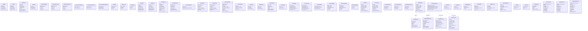

```mermaid
classDiagram
class ArcBase {
  string name
  ArcType type
  string description
  ArcStatus status
}
class ArcCreate {
  string name
  ArcType type
  string description
  ArcStatus status
}
class ArcResponse {
  string name
  ArcType type
  string description
  ArcStatus status
  UUID id
  datetime created_at
  datetime updated_at
}
class ArcUpdate {
  string name
  string description
  ArcStatus status
}
class CharacterArcBase {
  UUID character_id
  UUID arc_id
  string role
  int progress
}
class CharacterArcCreate {
  UUID character_id
  UUID arc_id
  string role
  int progress
}
class CharacterArcResponse {
  UUID character_id
  UUID arc_id
  string role
  int progress
}
class CharacterTimelineBase {
  UUID character_id
  UUID timeline_id
}
class CharacterTimelineCreate {
  UUID character_id
  UUID timeline_id
}
class CharacterTimelineResponse {
  UUID character_id
  UUID timeline_id
  datetime joined_at
}
class EntityBase {
  EntityType type
  string name
  dict state
}
class EntityCreate {
  EntityType type
  string name
  dict state
}
class EntityResponse {
  EntityType type
  string name
  dict state
  UUID id
  datetime created_at
  datetime updated_at
}
class EntityUpdate {
  string name
  dict state
}
class EventBase {
  UUID scene_id
  string type
  UUID initiator_id
  string description
  dict[] state_changes
  UUID[] witnesses
}
class EventCreate {
  UUID scene_id
  string type
  UUID initiator_id
  string description
  dict[] state_changes
  UUID[] witnesses
}
class EventResponse {
  UUID scene_id
  string type
  UUID initiator_id
  string description
  dict[] state_changes
  UUID[] witnesses
  UUID id
  datetime created_at
}
class GenerateRequest {
  string instruction
  UUID scene_id
  UUID initiator_id
  bool auto_log
  bool append_prose
  string location_context
}
class GenerateResponse {
  string prose
  dict[] suggested_state_changes
}
class MemoryBase {
  UUID character_id
  UUID event_id
  int clarity
  int emotional_weight
  datetime last_recalled_at
  string notes
}
class MemoryCreate {
  UUID character_id
  UUID event_id
  int clarity
  int emotional_weight
  datetime last_recalled_at
  string notes
}
class MemoryResponse {
  UUID character_id
  UUID event_id
  int clarity
  int emotional_weight
  datetime last_recalled_at
  string notes
  UUID id
  datetime created_at
}
class MemoryUpdate {
  int clarity
  int emotional_weight
  datetime last_recalled_at
  string notes
}
class ProjectBase {
  UUID user_id
  string name
  string description
}
class ProjectCreate {
  UUID user_id
  string name
  string description
}
class ProjectResponse {
  UUID user_id
  string name
  string description
  UUID id
  datetime created_at
  datetime updated_at
}
class ProjectUpdate {
  string name
  string description
}
class PromiseBase {
  string description
  UUID setup_event_id
  PromiseStatus status
  UUID resolution_event_id
  string target_scene
}
class PromiseCreate {
  string description
  UUID setup_event_id
  PromiseStatus status
  UUID resolution_event_id
  string target_scene
}
class PromiseResponse {
  string description
  UUID setup_event_id
  PromiseStatus status
  UUID resolution_event_id
  string target_scene
  UUID id
  datetime created_at
}
class PromiseUpdate {
  PromiseStatus status
  UUID resolution_event_id
  string target_scene
}
class RelationshipBase {
  UUID source_id
  UUID target_id
  RelationshipType type
  int strength
  dict state
}
class RelationshipCreate {
  UUID source_id
  UUID target_id
  RelationshipType type
  int strength
  dict state
}
class RelationshipResponse {
  UUID source_id
  UUID target_id
  RelationshipType type
  int strength
  dict state
  UUID id
  datetime created_at
  datetime updated_at
}
class RelationshipUpdate {
  int strength
  dict state
}
class SceneBase {
  string title
  int chapter_number
  int order_in_chapter
  SceneStatus status
  string prose
  int word_count
  UUID pov_character_id
}
class SceneCreate {
  string title
  int chapter_number
  int order_in_chapter
  SceneStatus status
  string prose
  int word_count
  UUID pov_character_id
}
class SceneResponse {
  string title
  int chapter_number
  int order_in_chapter
  SceneStatus status
  string prose
  int word_count
  UUID pov_character_id
  UUID id
  datetime created_at
  datetime updated_at
}
class SceneThemeBase {
  UUID scene_id
  UUID theme_id
  int relevance
}
class SceneThemeCreate {
  UUID scene_id
  UUID theme_id
  int relevance
}
class SceneThemeResponse {
  UUID scene_id
  UUID theme_id
  int relevance
}
class SceneUpdate {
  string title
  int chapter_number
  int order_in_chapter
  SceneStatus status
  string prose
  int word_count
  UUID pov_character_id
}
class SnapshotResponse {
  EntityResponse[] entities
  RelationshipResponse[] relationships
  PromiseResponse[] open_promises
  SceneResponse[] recent_scenes
  string active_location
}
class ThemeBase {
  string name
  string description
}
class ThemeCreate {
  string name
  string description
}
class ThemeResponse {
  string name
  string description
  UUID id
}
class TimelineBase {
  string name
  bool is_prime
  UUID divergence_event_id
  string status
}
class TimelineCreate {
  string name
  bool is_prime
  UUID divergence_event_id
  string status
}
class TimelineResponse {
  string name
  bool is_prime
  UUID divergence_event_id
  string status
  UUID id
  datetime created_at
}
class UserBase {
  string username
  string email
}
class UserCreate {
  string username
  string email
}
class UserResponse {
  string username
  string email
  UUID id
  datetime created_at
}
class VocabularyBase {
  VocabTermType term_type
  string uri
  string local_name
  string label
  string description
  string domain
  string range
  string category
}
class VocabularyCreate {
  VocabTermType term_type
  string uri
  string local_name
  string label
  string description
  string domain
  string range
  string category
}
class VocabularyResponse {
  VocabTermType term_type
  string uri
  string local_name
  string label
  string description
  string domain
  string range
  string category
  UUID id
  datetime created_at
}
SnapshotResponse --> EntityResponse : entities
SnapshotResponse --> RelationshipResponse : relationships
SnapshotResponse --> PromiseResponse : open_promises
SnapshotResponse --> SceneResponse : recent_scenes
```